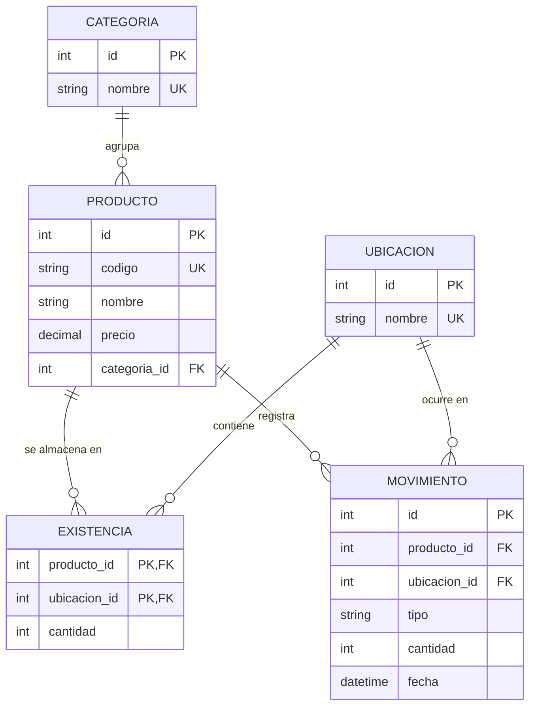

# Diagrama entidad-relación del almacén

Borrador para ajustar en equipo. GitHub dibuja este diagrama automáticamente al abrir el archivo.

## Relaciones

| Relación | Tipo | Implementación |
|---|---|---|
| Categoría y Producto | 1:N | `producto.categoria_id` |
| Producto y Ubicación | N:M | tabla intermedia `existencia` |
| Producto y Movimiento | 1:N | `movimiento.producto_id` |
| Ubicación y Movimiento | 1:N | `movimiento.ubicacion_id` |

## Decisiones de claves

- `id` entero autogenerado como PK en `categoria`, `producto`, `ubicacion` y `movimiento`.
- `producto.codigo` es único (RI-01) pero no es la PK: separa la identidad técnica del código de negocio.
- `existencia` usa PK compuesta (`producto_id`, `ubicacion_id`): un producto aparece una sola vez por ubicación.
- Los nombres de categoría y ubicación son únicos, para evitar duplicados con distinto formato.
